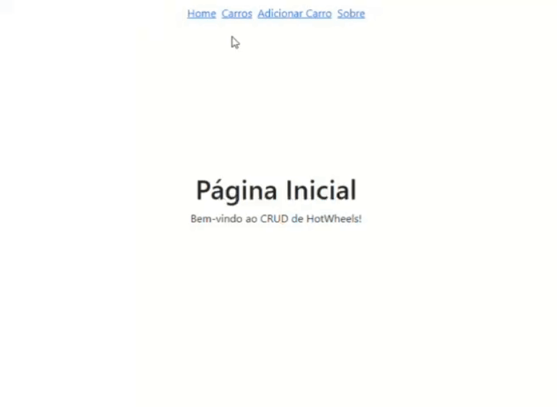

## Projeto CRUD Hot Wheels - FASE 1
Para executar este projeto:

1. Entre pasta context-react-project no terminal:
```
cd hotwheelscars
```

2. Rode npm install para instalar as dependências do projeto, como Bootstrap, Font Awesome e React Router:

```
npm install
```
```
npm install --save @fortawesome/fontawesome-svg-core
npm install --save @fortawesome/free-solid-svg-icons
npm install --save @fortawesome/free-regular-svg-icons
npm install --save @fortawesome/free-brands-svg-icons
npm install --save @fortawesome/react-fontawesome@latest
```
```
npm install react-bootstrap bootstrap
```
```
npm i -D react-router-dom
```

3. E em seguida, npm start, para iniciar a execução do projeto.

```
npm start
```
Após execução do projeto, este é o resultado esperado no navegador:


## Dados
Os dados utilizados são provenientes do diretório `./src/Data`, onde o arquivo `carsData` contêm os objetos estáticos para listagem.

## Componentes

Os componentes estão no diretório `./src/Components`, onde cada componente possui seu próprio diretório, e eles possuem as seguintes características:
- Navbar:
    - Descrição: este componente utiliza props com map, para que no App seja criado uma lista de objetos, com o link e o titulo. Esta sendo uma barra de navegação com as páginas disponíveis no projeto.
- Home:
    - Descrição: este componente renderiza uma mensagem de boas vindas.
- CarDetail:
    - Descrição: este componente faz o detalhamento, trazendo o contexto do `carsData` para o render e manipula as lógicas para adição e subtração de objetos.
- CarForm:
    - Descrição: este componente renderiza os inputs, bem como os botões de "salvar", se estiver no handle de edição, o botão de "adicionar", se estiver no handle de adição, e o botão cancelar.
- CarsList:
    - Descrição: este componente faz a renderização, listando os carros presentes no `carsData` e de novos objetos adicionados pelo `CarForm`.
- About:
    - Descrição: este componente renderiza uma descrição sobre o projeto.