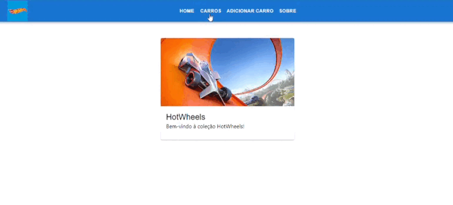

## Projeto CRUD Hot Wheels - FASE 1
Para executar este projeto:

1. Entre pasta context-react-project no terminal:
```
cd hotwheelscars
```

2. Rode npm install para instalar as dependências do projeto, como MUI, axios e React Router:

```
npm install
```

3. E, em seguida, npm start, para iniciar a execução do projeto.

```
npm start
```
Após execução do projeto, este é o resultado esperado no navegador:


## Dados
Os dados utilizados são provenientes da API `hotwheels-api`, onde contêm os objetos estáticos para listagem.

## Componentes

Os componentes estão no diretório `./src/Components`, onde cada componente possui seu próprio diretório, e eles possuem as seguintes características:
- Navbar:
    - Descrição: este componente utiliza props com map, para que no App seja criado uma lista de objetos, com o link e o titulo. Esta sendo uma barra de navegação com as páginas disponíveis no projeto.
- Home:
    - Descrição: este componente renderiza uma mensagem de boas vindas.
- CarDetail:
    - Descrição: este componente faz o detalhamento, trazendo o contexto da API para o render e manipula as lógicas para adição e subtração de objetos.
- CarForm:
    - Descrição: este componente renderiza os inputs, bem como os botões de "salvar", se estiver no handle de edição, o botão de "adicionar", se estiver no handle de adição, e o botão cancelar.
- CarsList:
    - Descrição: este componente faz a renderização, listando os carros presentes na API e de novos objetos adicionados pelo `CarForm`.
- About:
    - Descrição: este componente renderiza uma descrição sobre o projeto.

## Hooks

O arquivo `useApi`, encontra-se no diretório `./src/Hooks` e faz a lógica de uso da API, junto com axios, para ser exportada e usada no `CarDetail`.